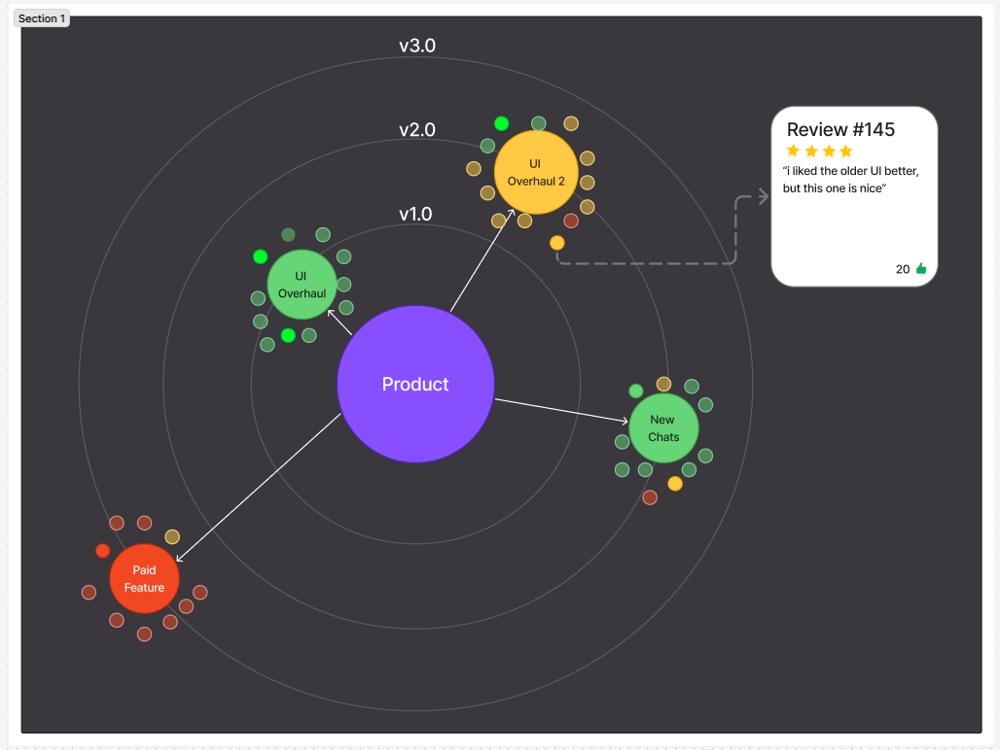

# review-galaxy

Review galaxy project repository for Large Scale Software Engineering ASN3.

## Development instructions

- `docker compose up -d --build` in root directory to spawn all services

## Task

This assignment asks you to work as a team to design and prototype a novel visualization for (1) the released software features, (2) the app reviews, or (3) the traceability of the two. A mandatory requirement is for the visualization to explicitly incorporate the temporal dimension, that is, when a feature is released and/or when a review is posted.

The software-feature and app-review datasets are provided as follows:

### Features

- Zoom released features (from Jan, 2022 to Jan, 2024; 571 total features provided)
- Webex released features (from Jan, 2022 to Dec, 2023; 258 total features provided)
- Firefox released features (from Jan, 2022 to Jan, 2024; 171 total features provided)

### App Reviews

- Zoom (from Jan, 2022 to Jan, 2024; 153,779 total reviews provided)
- Webex (from Jan, 2022 to Dec, 2023; 55,558 total reviews provided)
- Firefox (from Jan, 2022 to Jan, 2024; 56,382 total reviews provided)  
  Several venues may help you to come up with a novel visualization and can be found below. It is crucial for everyone to read some literature to inform and inspire your team's visual design. Explicitly referring to the papers (at least 5 papers) is mandatory for your team's video presentation checkpoint.

Our group, team white, was randomly selected to do the third option, to create a novel visualization for the traceability of both the released software features and the app reviews.

### Features

### App Reviews

## Initial Discussion

To do this we first met and created mock-up examples of novel, meaning new, ways to display the data in Figma.  
  
We each went around and gave a brief explanation of our design, then held a quick voting session to decide which model we were going use. In the end we decided to proceed with the galaxy model as we had multiple students who all had similar ideas.  
  
To give a brief explanation of the idea before it was implemented, we wanted to create a node system that was formatted around a radial layout to show the evolution of the product. Each node in the outer radius is an update to the central product, and each node around that are reviews of said update. Each small node, excluding the central one, is also color-coded to align with the reviews around the implemented update; green is good, yellow is mixed, and red is bad. The node for the specific update is colored based on a calculated average of the reviews surrounding it.

We also created a [PowerPoint](https://mailuc-my.sharepoint.com/:p:/g/personal/margesji_mail_uc_edu/EV0HfbJDVUZAlUoFxcsqevABoRQTFW2yEZ1GA20PCp1Urg?e=L68SYW) and video presentation, if you'd like to hear about each person's model and ideas.  
[YouTube Video](https://www.youtube.com/watch?v=C098xbeYD6s)

## Implementation

Over the next couple of weeks we constructed our novel galaxy approach. We did this using Angular, a typescript-based open-source single-page web application framework, for the front end design and Middleware, a software that sits between applications, operating systems, and database to facilitate communication and data exchange, for our data transfer. To run the project we used Docker, an open-source platform that allows developers to build, run, and manage applications within portable containers, see the instructions at the top of the README to run our project yourself!

We created three different versions for each software including Zoom, Webex, and Firefox.

## Zoom

## Webex

## Firefox

## Additional Information

We had to create a novel idea for this project, it needed to be something new and not commonly used to display data in regular database systems. We believe we've accomplished this by designing our model with the following in mind:

- Radial layout to show the evolution of product​
- Diagrams time, theme, sentiment, and popularity relations in one view​
- Preserves temporal and hierarchical relationships​
- Reviews are grouped by feature to expose feedback to specific updates​
- Heatmap effect to identify high-impact reviews

We implemented key features that would benefit the user including:

- Highlights top-rated responses​
- Enables quick assessment of review sentiment​
- Groups reviews by release version and deployed features​
- Supports examining individual reviews
- Intuitive design that allows end-users to successfully navigate our visualization

We faced multiple challenges throughout this project, one being the sheer amount of data we were given. As an example, Zoom app reviews alone had 153,780 lines of data! If we tried to actually load that into our systems and on the user's computer, it'd crash our application within seconds. To get around this, we filtered the data based on their "thumbsUpCount," or the number of likes the review got. We grabbed and displayed a limited amount of the most liked reviews as those are going to be most prominent to the user.

We also faced serveral other challenges including database functionality, integration betweeen multiple services, and merge conflicts in the repository. These were all to be expected as we had a large group and a lot of the systems we used throughout implementation were new to our members.

Feel free to check out our [final presentation](https://docs.google.com/presentation/d/1XO2_HDc0xeXIDmuq63VFJTSLCKf5rmjJzemnsH5_9Vk/edit?usp=sharing)!
